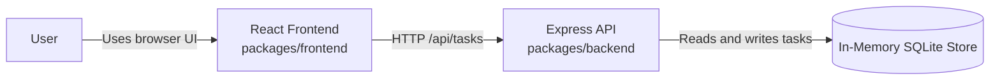
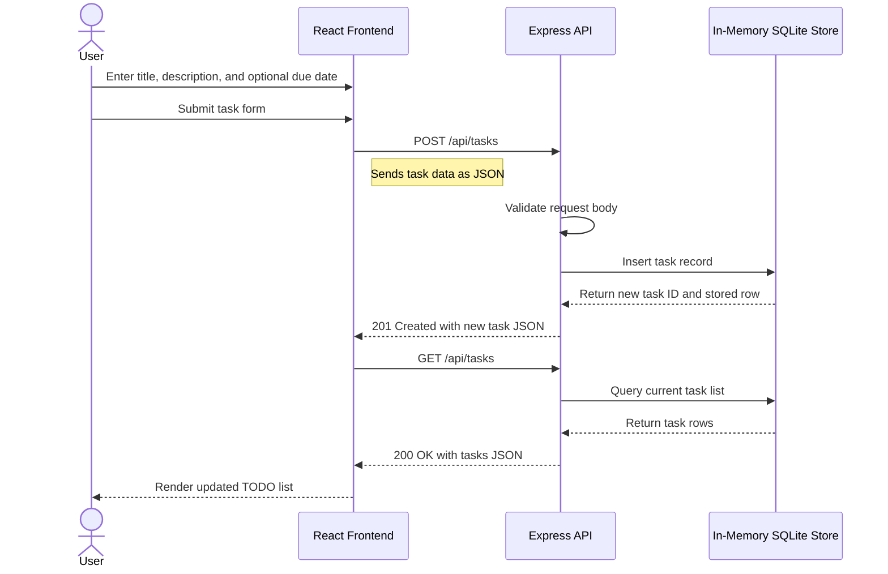

# Cloud Architecture Overview

This monorepo runs as a simple full-stack application with a React frontend and an Express backend. The frontend sends HTTP requests to the backend API, and the backend stores task data in an in-memory SQLite database using `better-sqlite3`.

Because the database is in memory, data exists only for the lifetime of the backend process. There are no external cloud services, managed databases, or third-party integrations in the current architecture.

## System Context

## Sequence: Creating a TODO

